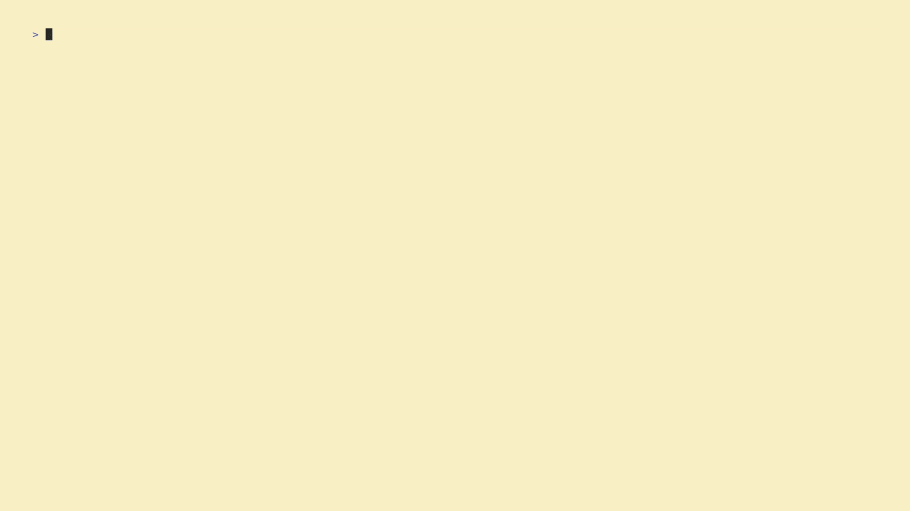

# MediaLogger TUI

This project is a Terminal User Interface to track movies, shows, and other media (Referred to as "works") that the user wants to read/watch/etc.



## Features:
- Add/Remove a work from the database.
- Edit a work already in the database.
- View all works currently in the database.
    - Sort/Filter existing works.
- Take notes/Write reviews on a work.

## Installation:
### Building from source:
1. Clone Repository
2. Run go build in the cloned repository
    - Requires go version 1.25.9
3. Add the executable to the PATH if desired

## Usage:
### Visual Language:
Position of the cursor in the app is communicated by a colored border along each component. If the border is the lighter color it indicates that the cursor is on that component or that component is "focused".

### Controls:
Currently not compatible with mouse input, all input is through the keyboard.
```
ctrl+c: Close the app
esc: Unfocus a component
enter: Focus a component/Confirm an input

H/J/K/L: Navigate "Top Level Components" on Home Page
h/j/k/l: Navigate within components
up/down/left/right: Navigate within components
```

## Technologies:
- Golang
    - [Bubbletea](https://github.com/charmbracelet/bubbletea)
    - [Lipgloss](https://github.com/charmbracelet/lipgloss)
- SQLite

## Issues and Requests:
Feel free to notify me of any feature requests or problems via the Issues tab in this repository.

## About:
GPLv3 License
Free and Open-Source. No data about the user is collected.
